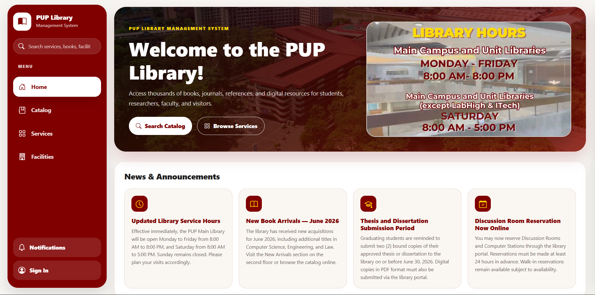
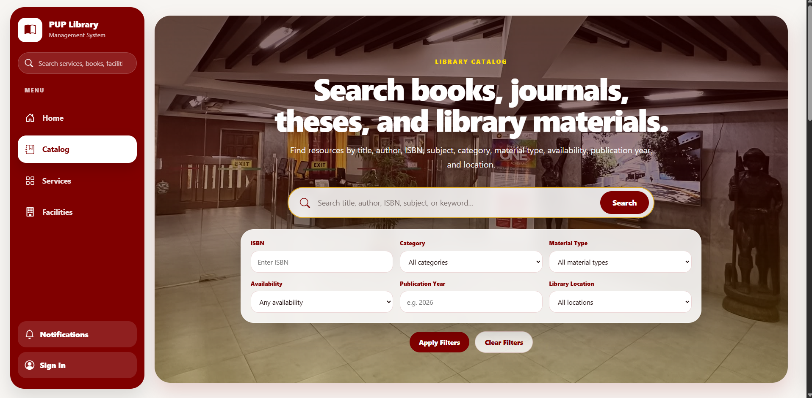
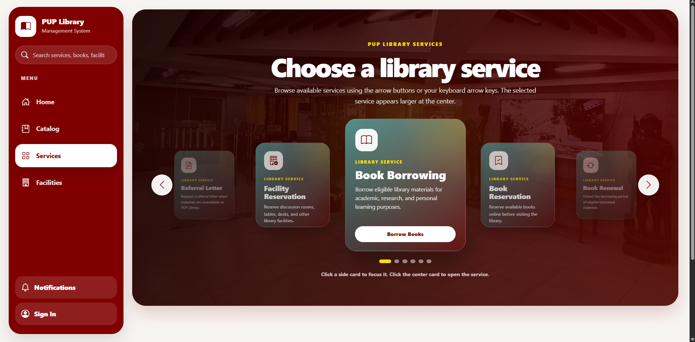
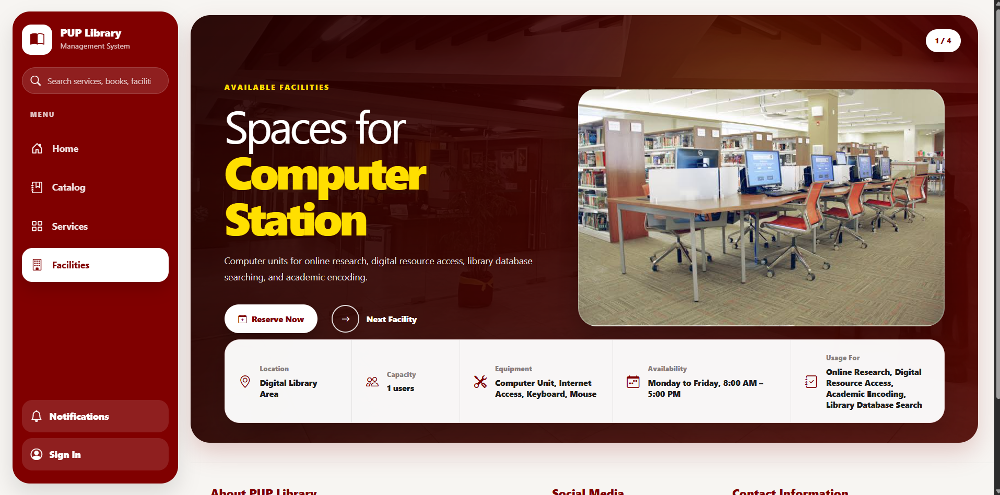
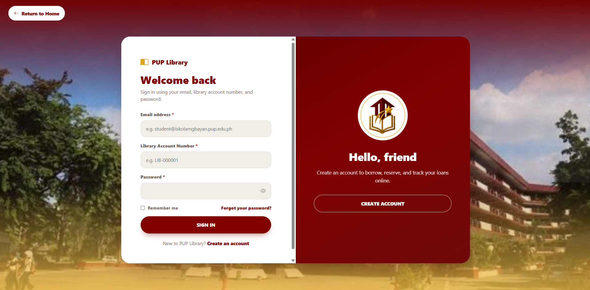

<div align="center">

# 📚 PUP Library Management System

### Polytechnic University of the Philippines – Library and Learning Resource Center


<br><br>

> Electronic Library Resource Management, Borrowing, Reservation, and Service Platform for the Polytechnic University of the Philippines.

</div>

---

# Overview

The **PUP Library Management System** is a web-based platform designed to streamline library operations and improve access to academic resources within the Polytechnic University of the Philippines.

The system enables students, faculty, employees, alumni, and visitors to efficiently search, borrow, reserve, and access library services while providing administrators with powerful tools for managing resources, users, and transactions.

---
<div align="center">

# System Preview

</div>

## Home Page



## Catalog Page



## Services Page



## Facilities Page



## Authentication Page



---
<div align="center">

# Features

</div>

##  Resource Catalog

- Catalog searching
- Resource availability tracking
- Material categorization
- Author and ISBN searching
- Publication year filtering
- Location filtering
- Digital resource access

## User Management

- Student Accounts
- Faculty Accounts
- Employee Accounts
- Alumni Accounts
- Visitor Accounts

## Administrative Dashboard

- User Management
- Resource Management
- Service Management
- Transaction Monitoring

## Library Services

- **Book Borrowing** – Allows users to request and borrow available library materials.
- **Book Reservation** – Lets users reserve resources and claim them within the allowed claiming period.
- **Book Renewal** – Allows eligible users to extend their borrowing period.
- **Book Return** – Supports return processing and updates copy availability.
- **Facility Reservation** – Enables users to reserve library facilities and rooms.
- **Online Resources** – Provides access to digital or online library materials.
- **Referral Letter Request** – Allows users to request referral letters for other library branches.
- **Service Request Processing** – Allows staff to review, approve, or reject submitted requests.
- **Request Status Tracking** – Lets users monitor the status of their submitted library requests.

---
<div align="center">

# System Architecture


```text
┌────────────────────────────┐
│        Frontend UI         │
│ Blade + Bootstrap + JS     │
└────────────┬───────────────┘
             │
             ▼
┌────────────────────────────┐
│     Laravel Controllers    │
│ Authentication / Catalog   │
│ Borrowing / Reservation    │
└────────────┬───────────────┘
             │
             ▼
┌────────────────────────────┐
│      Business Logic        │
│ Services & Validation      │
└────────────┬───────────────┘
             │
             ▼
┌────────────────────────────┐
│      PostgreSQL DB         │
│         Supabase           │
│ Users / Resources / Copies │
│ Transactions / Services    │
└────────────────────────────┘

```

# Database Design

</div>

### Core Tables

```sql
users
roles
account_statuses

resources
authors
resource_authors

resource_copies
copy_statuses

borrow_transactions
reservations
penalties

categories
material_types
locations
```

### Main Relationships

```text
Users
 │
 ├── Borrow Transactions
 ├── Reservations
 │
Resources
 │
 ├── Resource Copies
 ├── Authors
 │
 └── Categories
```

---
<div align="center">

# User Roles


| Role | Permissions |
|--------|-------------|
| Student | Search, Borrow, Reserve, Services |
| Faculty | Search, Borrow, Reserve, Services |
| Employee | Search, Borrow, Reserve, Services |
| Staff | Manage Resources, Users, and Transactions |

---

# Technology Stack

| Technology | Purpose |
|------------|---------|
| Laravel 12 | Backend Framework |
| PHP 8.2 | Server-side Programming |
| PostgreSQL (Supabase) | Database |
| Bootstrap 5 | User Interface |
| JavaScript | Frontend Interactivity |
| Vite | Asset Bundling |
| Railway | Deployment Platform |

---

# Installation

</div>

## Clone Repository

```bash
git clone https://github.com/jaedone/library-system.git

cd library-system
```

## Install Dependencies

```bash
composer install

npm install
```

## Configure Environment

```bash
cp .env.example .env
```

Update your database credentials:

```env
request the credentials to the student developers
```

## Generate Application Key

```bash
php artisan key:generate
```

## Run Migrations

```bash
php artisan migrate
```

## Build Frontend Assets

Development:

```bash
npm run dev
```

Production:

```bash
npm run build
```

## Start Application

```bash
php artisan serve
```

---

<div align="center">

# Security Features

</div>

- Password Hashing
- CSRF Protection
- Input Validation
- Session Authentication
- Role-Based Access Control
- Authorization Middleware
- Protected Administrative Routes

---

<div align="center">

# Future Enhancements

</div>

- RFID Integration
- QR Code Borrowing
- Email Notifications
- SMS Notifications
- Mobile Application
- Analytics Dashboard
- AI-Based Book Recommendations
- Automated Fine Computation

---

<div align="center">

# Development Team

</div>

### BS Computer Science Students

**Polytechnic University of the Philippines**

| Member | Role |
|----------|--------|
| Mark Joseph B. Neypes | Developer |
| Princess Izzy Dancal | Quality Assurance |
| Samantha Salmorin | UI Designer |
| John Paul Asuzano | UI Designer |

---

<div align="center">

# License / Project Use

</div>

This project was developed for academic purposes as part of our Web Development course under the Bachelor of Science in Computer Science program at the Polytechnic University of the Philippines.


<div align="center">

Made with ❤️ by Team 1 Group 4 of BSCS 3-5

</div>